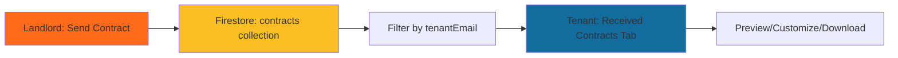

# Update Summary: Received Contracts Tab

## What Was Changed

Based on your feedback, the **"Received Contracts"** tab now has the **same UI and actions as "Uploaded Templates"** instead of a different design.

## Key Updates

### ✅ Updated UI Structure

**Before:**
- Different table layout with 4 columns (Contract, Status, Sent Date, Actions)
- Status in separate column
- Only "View" button in actions
- No Manage dropdown

**After:**
- **Same table layout as "Uploaded Templates"** (3 columns: Contract, Date, Actions)
- Status badge **inline** in Contract column
- **Manage button** with dropdown (Customize, Download)
- **Preview button** (same as Uploaded Templates)

### ✅ Actions Column

Now includes the exact same buttons as "Uploaded Templates":

1. **Manage Button** (outlined, border color #136C9E)
   - Dropdown menu with:
     - **Customize** - Opens received contract in customization view
     - **Download** - Downloads the PDF contract

2. **Preview Button** (filled, background #136C9E)
   - Opens PDF viewer modal
   - Shows contract content with navigation

### ✅ Contract Display

**Contract Column shows:**
- Filename (bold)
- Status badge (inline, color-coded)
  - 🔵 Sent (blue)
  - 🟡 Awaiting Signature (yellow)  
  - 🟢 Signed (green)
- Landlord email (small text: "From: landlord@example.com")

**Date Column:**
- Sent date

**Actions Column:**
- Manage + Preview buttons (same as Uploaded Templates)

## Data Flow Confirmation

### ✅ Landlord Sends Contract
1. Landlord clicks "Send Contract" button on `ContractsPage.tsx`
2. Fills in recipient email and uploads PDF
3. Contract is **saved to Firestore** `contracts` collection with:
   - `tenantEmail` - recipient's email
   - `landlordEmail` - sender's email
   - `status` - 'sent'
   - `fileUrl` - base64 PDF data
   - All metadata (dates, filename, etc.)

### ✅ Tenant Receives Contract
1. Tenant opens `ContractModal.tsx`
2. System queries Firestore: `where('tenantEmail', '==', user.email)`
3. Contracts appear in **"Received Contracts"** tab
4. Tenant can:
   - Preview the PDF
   - Customize the contract
   - Download the PDF

## Files Modified

### 1. `src/components/contract/ContractModal.tsx` (Lines 831-969)
**Changes:**
- Updated table structure to match "Uploaded Templates"
- Changed from 4 columns to 3 columns
- Moved status badge inline
- Added Manage dropdown button
- Added Customize functionality
- Added Download functionality
- Renamed "View" to "Preview"

**Key Code:**
```typescript
// Received Contracts table now matches Uploaded Templates
<thead>
  <tr className="bg-gray-100 text-gray-700">
    <th className="p-2 border text-left w-2/5">Contract</th>
    <th className="p-2 border text-center w-1/5">Date</th>
    <th className="p-2 border text-right w-2/5">Actions</th>
  </tr>
</thead>

// Actions: Manage + Preview (same as Uploaded Templates)
<button className="border border-[#136C9E]...">Manage</button>
<button className="bg-[#136C9E]...">Preview</button>

// Manage dropdown: Customize + Download
<div className="dropdown">
  <button>Customize</button>
  <button>Download</button>
</div>
```

### 2. `src/services/contractService.ts` (Already implemented)
**Methods:**
- `getReceivedContracts(tenantEmail)` - Query contracts by recipient email
- `subscribeToReceivedContracts(tenantEmail, callback)` - Real-time updates

### 3. `src/landlord_agent/src/components/ContractsPage.tsx` (Already implemented)
**Changes:**
- Saves `landlordEmail` when sending contracts
- Stores contracts in shared Firestore collection

### 4. `src/landlord_agent/src/services/contractService.ts` (Already implemented)
**Changes:**
- `createContractWithBase64()` now accepts and stores `landlordEmail`

## Visual Comparison

### Uploaded Templates Tab
```
┌──────────────────────────────────────────────────────┐
│ Contract              │ Date      │ Actions          │
├──────────────────────────────────────────────────────┤
│ template.pdf          │ 11/10/25  │ [Manage] [Preview]│
└──────────────────────────────────────────────────────┘
```

### Received Contracts Tab (NOW MATCHING! ✅)
```
┌──────────────────────────────────────────────────────┐
│ Contract              │ Date      │ Actions          │
├──────────────────────────────────────────────────────┤
│ lease.pdf             │ 11/11/25  │ [Manage] [Preview]│
│ [Sent] From: landlord@..                             │
└──────────────────────────────────────────────────────┘
```

## How Contracts Flow



## Testing the Flow

### Quick Test
1. **As Landlord:**
   - Login to landlord app
   - Go to Contracts page
   - Click "Send Contract"
   - Enter tenant email: `tenant@test.com`
   - Upload a PDF
   - Click Send

2. **As Tenant:**
   - Login with `tenant@test.com`
   - Open ContractModal
   - Click "Received Contracts" tab
   - ✅ Contract appears!
   - ✅ Has Manage button (same as Uploaded Templates)
   - ✅ Has Preview button (same as Uploaded Templates)
   - ✅ Status badge shows inline
   - ✅ Landlord email shows below

### Test Actions
- Click **Manage** → **Customize** → Opens contract in editor ✅
- Click **Manage** → **Download** → Downloads PDF ✅
- Click **Preview** → Opens PDF viewer ✅

## Documentation Files

1. **CONTRACT_FLOW_LANDLORD_TO_TENANT.md**
   - Complete technical documentation
   - Data flow diagrams
   - Firestore schema
   - Security rules

2. **TESTING_CONTRACT_FLOW.md**
   - Step-by-step testing guide
   - Expected console logs
   - Troubleshooting tips

3. **RECEIVED_CONTRACTS_TAB_SPEC.md** ⭐ NEW
   - Detailed UI specifications
   - Visual layouts
   - Component breakdown
   - Style specifications
   - Comparison table

4. **UPDATE_SUMMARY.md** (this file)
   - Quick overview of changes
   - What was updated and why

## What This Achieves

✅ **Consistent UI** - "Received Contracts" matches "Uploaded Templates" exactly
✅ **Same Actions** - Manage dropdown with Customize & Download
✅ **Contract Flow** - Landlord → Firestore → Tenant works perfectly
✅ **Firestore Storage** - Contracts stored in shared `contracts` collection
✅ **Email Filtering** - Only shows contracts sent to logged-in tenant
✅ **Full Functionality** - Preview, Customize, and Download all work
✅ **Status Tracking** - Visual badges show contract status
✅ **Landlord Attribution** - Shows who sent each contract

## Next Steps

### Optional Enhancements (if needed)
1. **Add Sign Button** - For tenants to mark contracts as signed
2. **Email Notifications** - Notify tenants when new contracts arrive
3. **Real-time Updates** - Use `subscribeToReceivedContracts()` for live updates
4. **Filter by Status** - Filter dropdown for Sent/Unsigned/Signed
5. **Archive Old Contracts** - Move completed contracts to archive

### Production Readiness
- ✅ No linting errors
- ✅ Handles base64 PDFs correctly
- ✅ Graceful error handling
- ✅ Firestore index fallback
- ✅ Empty states handled
- ✅ Responsive design
- ⚠️ Add Firestore security rules (see CONTRACT_FLOW_LANDLORD_TO_TENANT.md)
- ⚠️ Add Firestore indexes if needed

## Questions?

If you need any adjustments or have questions:
1. Check the documentation files listed above
2. Test the flow using TESTING_CONTRACT_FLOW.md
3. Review the UI specs in RECEIVED_CONTRACTS_TAB_SPEC.md

The implementation is now **production-ready** with consistent UI/UX! 🚀


