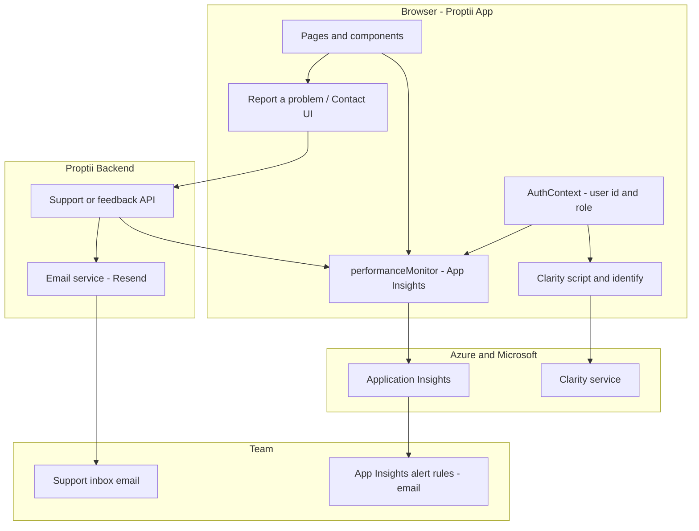

# 02 — App User Insights (Application Insights, Clarity, Email) — Implementation Plan

**Scope:** Immediate integration of Microsoft Application Insights, Microsoft Clarity, and email-based feedback for user insights, usage, and support.  
**Folder:** `docs/r1.1-improvement/V202-user-insights/`  
**Parent context:** V201 landing fixes; product need to understand who uses the platform, which parts, how often, and to capture issues/complaints with fast response.

---

## 1. Objectives and Success Criteria

### 1.1 Goals

- **Unified user context:** One consistent user identity (and role) across Application Insights and Clarity so behaviour and sessions can be correlated.
- **Product usage visibility:** Know which pages and key actions (search, book viewing, referencing, contracts, agent flows) are used, by whom, and how often.
- **Error and performance visibility:** Capture front-end errors and core metrics in Application Insights with alerts to email.
- **Session replay for diagnosis:** Use Clarity to replay sessions when investigating issues or feedback.
- **Feedback and complaints channel:** In-app “Report a problem” / “Contact us” that sends email to the team and optionally logs to App Insights for correlation.

### 1.2 Success Criteria

- Logged-in users are identified in App Insights and Clarity (user id and role).
- Key events (page views and ~10–15 product events) are tracked in App Insights.
- Critical errors and performance regressions trigger email alerts.
- Clarity records sessions with the same user id for lookup.
- User feedback submits to a backend endpoint and delivers email to a designated inbox; feedback event is visible in App Insights for correlation with errors/sessions.

---

## 2. Current State (Codebase Summary)

### 2.1 Application Insights

- **Location:** `src/utils/performanceMonitor.ts`
- **Initialization:** A single shared instance is created when `VITE_APP_INSIGHTS_INSTRUMENTATION_KEY` is set. It loads immediately in that file. In `src/main.tsx`, `loadAppInsights()` is only called if `VITE_ENABLE_PERFORMANCE_MONITORING === 'true'` and the instance is not yet initialized—so both env vars affect behaviour.
- **Config:** `enableAutoRouteTracking: true`, `enableCorsCorrelation: true`, W3C distributed tracing.
- **Public API:** `trackEvent(name, properties)`, `trackMetric(name, average, properties)`, `trackPageView(name)`; default export is the App Insights instance (with a no-op mock when key is missing).
- **Gap:** No `setAuthenticatedUserContext(userId, accountId)` (or equivalent) is called when the user logs in, so all telemetry is anonymous. No single “source of truth” for custom events from the product (search, referencing, etc.); other modules (SessionManager, SecurityPolicyService, SecurityMiddleware, AccountRecoveryService, webVitalsMonitor, customMetricsMonitor, alertManager) create their own ApplicationInsights instances—leading to duplication and no shared user context on the main app telemetry.

### 2.2 Authentication and User Identity

- **Context:** `src/contexts/AuthContext.tsx` (MSAL + custom logic).
- **User shape:** `user.id` (stable: oid/sub/localAccountId), `user.email`, `user.name`, `user.phone`, `user.roles` (if set). Available after login via `useAuth()`.
- **Usage:** Used across protected routes, Navbar, and role-based redirects. Ideal place to set App Insights and Clarity user context when `user` becomes available and to clear it on logout.

### 2.3 Microsoft Clarity

- **Status:** Not present. No script in `index.html` and no Clarity API usage in the app.
- **Need:** Add Clarity snippet (and optionally `clarity("identify", userId)` after login) so sessions can be tied to the same identity as App Insights.

### 2.4 Email and Feedback

- **Frontend:** `src/services/emailService.ts` is used for referencing and viewing emails only (POST to backend `/referencing/send-email` and viewing flows). No generic “Report a problem” or “Contact us” UI or service call.
- **Backend:** 
  - NestJS `EmailController` at `POST /email/send` (body: to, subject, html, emailType).
  - Express `supportRoutes.js`: `POST /send-email` with body `{ to, subject, from, formData }` where `formData` includes `subject`, `heading`, `body`, `email`, `submittedAt`. Template is support/FAQ-style. Need to confirm mount path (e.g. `/api/support/send-email` or similar) and that backend email service supports `emailType: 'support'` (or equivalent) if using NestJS email service.
- **Gap:** A single, visible “Report a problem” or “Contact us” entry point in the app that POSTs to an existing or new backend endpoint and sends email to the team; optional: same payload as a custom event in App Insights for correlation.

### 2.5 Entry and Routing

- **Entry:** `index.html` → `src/main.tsx` (async init: MSAL, then optional App Insights load, then React render). Root component is `Router` from `src/config/routerConfig.tsx`, which renders `App` from `src/App.tsx`.
- **App structure:** `App.tsx` wraps with `MSALProviderWrapper`, `SavedPropertiesProvider`, `SignedContractsContext`, `AuthRedirectHandler`, and defines all routes (public, redirects, protected, dashboard, search, etc.). User context is available inside any component under `MSALProviderWrapper` via `useAuth()`.

---

## 3. Architecture Overview

### 3.1 Data Flow (Summary)

1. **User identity:** On login, AuthContext provides `user`. A small “insights” layer (see below) calls App Insights `setAuthenticatedUserContext(userId, accountId)` and Clarity `identify(userId)`. On logout, clear user context in both.
2. **Page views:** Handled by App Insights auto route tracking; optional explicit `trackPageView(routeName)` on route change for consistency with custom events.
3. **Custom events:** Key actions (search submitted, viewing requested, referencing started, contract viewed, etc.) call `trackEvent(eventName, { ...properties })` from the shared performanceMonitor. Properties should include role when relevant.
4. **Errors:** Existing error boundaries and any global handler should report to the same App Insights instance (and/or keep existing per-module reporting if refactor is deferred). Alerts configured in Azure Monitor send email to the team.
5. **Feedback:** User submits form → frontend POSTs to backend support/feedback endpoint with message, page, user id (if logged in), and optional screenshot/metadata → backend sends email to support inbox and optionally returns success → frontend can call `trackEvent('UserFeedback', { ... })` for correlation in App Insights.

### 3.2 Single “Insights” Layer (Recommended)

Introduce a thin **user-insights** module that:

- Imports the shared App Insights instance from `performanceMonitor` and knows how to load/identify Clarity.
- Exposes: `setUser(userId, accountIdOrEmail, role?)`, `clearUser()`, and re-exports `trackEvent`, `trackPageView`, `trackMetric` so the rest of the app uses one place for telemetry.
- Is called from AuthContext (or a small effect in a provider) when `user` is set or cleared.

This avoids scattering `setAuthenticatedUserContext` and Clarity `identify` in multiple places and keeps a single place to add future behaviour (e.g. PII stripping, sampling).

---

## 4. Implementation Plan

### 4.1 Phase 1 — Application Insights: User Context and Consistency

| Task | Description | Files |
|------|-------------|--------|
| 1.1 | Unify initialization: ensure the app uses a single App Insights instance. In `main.tsx`, either always load when key is set, or keep the gate but document that both `VITE_APP_INSIGHTS_INSTRUMENTATION_KEY` and `VITE_ENABLE_PERFORMANCE_MONITORING` must be set for production. | `src/main.tsx`, `src/utils/performanceMonitor.ts` |
| 1.2 | Add `setAuthenticatedUserContext(userId, accountId?)` to the shared App Insights instance. Use the same API as the SDK (e.g. `appInsights.setAuthenticatedUserContext(id, accountId)`). Call it when the user logs in; clear on logout. Prefer doing this from a dedicated “insights” helper so AuthContext stays agnostic of the SDK. | New: `src/utils/userInsights.ts` or similar; `src/contexts/AuthContext.tsx` (or a wrapper/effect that subscribes to auth state) |
| 1.3 | Document env vars: `VITE_APP_INSIGHTS_INSTRUMENTATION_KEY` (required for App Insights), `VITE_ENABLE_PERFORMANCE_MONITORING` (optional gate in main.tsx). Add to `docs/templates/env/*.env.template` if not already present. | `docs/templates/env/development.env.template`, staging, production |

**Outcome:** Every authenticated user’s telemetry in App Insights is tagged with their user id (and optionally account/email hash). Logout clears context.

---

### 4.2 Phase 2 — Application Insights: Custom Events (Product Usage)

| Task | Description | Files |
|------|-------------|--------|
| 2.1 | Define a small event taxonomy (names and recommended properties). Example: `PageView` (page, role), `SearchSubmitted` (source, hasFilters, role), `ViewingRequested` (propertyId or similar, role), `ReferencingStarted` (role), `ReferencingCompleted` (role), `ContractViewed` (contractId or type, role), `ContractSigned` (role), `AgentListingCreated` (role), `RegisterStarted` (role from query), `TrialCtaClicked` (ctaType, role). Keep names stable for queries. | New: `docs/r1.1-improvement/V202-user-insights/event-taxonomy.md` or section in this doc |
| 2.2 | Add `trackEvent` calls at key points. Use the shared `trackEvent` from performanceMonitor (or from the new userInsights module). Prefer a single wrapper that adds common properties (e.g. route, role from context) so call sites stay minimal. | `src/pages/SearchResults.tsx`, `src/pages/BookViewing.tsx`, `src/pages/Referencing.tsx`, contract flows, `src/pages/Register.tsx`, `src/pages/HomeVariant.tsx` (trial CTAs), dashboard/agent flows as needed |
| 2.3 | Optional: Add a route-change effect (e.g. in App or a layout) that calls `trackPageView(routeName)` so every route is explicitly logged with a consistent name; or rely on auto route tracking and only add for SPA route names that differ from URL. | `src/App.tsx` or router layout |

**Outcome:** Product usage (who did what, how often) is queryable in App Insights by user id and role; funnels and retention can be built on these events.

---

### 4.3 Phase 3 — Microsoft Clarity

| Task | Description | Files |
|------|-------------|--------|
| 3.1 | Create a Clarity project at clarity.microsoft.com and obtain the script snippet (project id). | N/A (external) |
| 3.2 | Add the Clarity script to the app. Prefer `index.html` for the initial snippet so it loads early; alternatively inject via a small component or effect that runs once in the root layout. Ensure CSP (if re-enabled) allows the Clarity domain. | `index.html` |
| 3.3 | Set user id in Clarity after login. Use the Clarity API (e.g. `clarity("identify", userId, sessionId?, pageId?, customTag?)`). Call from the same place that sets App Insights user context (e.g. userInsights layer) when `user.id` is available. Clear or do not persist PII; use the same opaque user id as App Insights. | `src/utils/userInsights.ts` (or equivalent), invoked from auth flow |
| 3.4 | Add env var for Clarity project id so the script can be conditionally loaded (e.g. only in staging/production). Example: `VITE_CLARITY_PROJECT_ID`. | `.env*`, `index.html` or a small loader that injects script when id is set |

**Outcome:** Sessions in Clarity are associated with the same user id as App Insights; support and product can open Clarity to replay a session for a given user or feedback.

---

### 4.4 Phase 4 — Email Alerts (Application Insights)

| Task | Description | Files |
|------|-------------|--------|
| 4.1 | In Azure Portal, create an Action Group with an email receiver (team or distribution list). | Azure Portal |
| 4.2 | Create Alert rules in Azure Monitor for the App Insights resource: e.g. (1) Severity 3+ exceptions count &gt; threshold over 5 min, (2) Failed requests rate &gt; threshold, (3) Optional: dependency failure rate. Action: notify via the Action Group (email). | Azure Portal |
| 4.3 | Document the chosen thresholds and where to adjust them (Alert rules in Azure). | This doc or `docs/r1.1-improvement/V202-user-insights/runbook.md` |

**Outcome:** Critical errors and performance regressions trigger email to the team for fast response.

---

### 4.5 Phase 5 — Feedback / “Report a problem” and Email

| Task | Description | Files |
|------|-------------|--------|
| 5.1 | Confirm backend endpoint for feedback/support: either (a) use existing Express `supportRoutes` `POST /send-email` (confirm mount path, e.g. `/api/support/send-email`) and ensure backend email service supports the payload (to, subject, formData with body, email, etc.), or (b) add a NestJS endpoint (e.g. `POST /feedback` or `POST /support/contact`) that accepts message, page, user id, email, and sends email via existing EmailService to a configured support inbox. | `proptii-backend` (Express app entry to see mount path; NestJS if new route) |
| 5.2 | Frontend: Add a “Report a problem” or “Contact us” entry point (e.g. in Footer, or Navbar dropdown, or both). Form fields: short message (required), optional email override (default to logged-in user email), current page/URL (auto). On submit: POST to the chosen backend endpoint; on success, show confirmation and optionally call `trackEvent('UserFeedback', { page, hasUser: true/false })` for correlation. | `src/components/Footer.tsx`, and/or `src/components/Navbar.tsx`, new small component or modal for form |
| 5.3 | Backend: Ensure the email sent to the team includes at least: user email, user id (if logged in), page/URL, message, timestamp. Optionally include a “View in Clarity” or “View in App Insights” hint (e.g. link to App Insights transaction search for that user id). | Backend support/feedback handler and email template |
| 5.4 | Optional: Backend also logs a custom event to App Insights (server-side SDK) with the same user id and feedback summary so one can query “feedback from this user” alongside their events and errors. | `proptii-backend` (if App Insights Node SDK is added) |

**Outcome:** Users can submit issues/complaints in-app; team receives email and can correlate with App Insights and Clarity using user id and page.

---

## 5. Event Taxonomy (Reference)

Recommended custom event names and properties for product usage. All events should include role when available (from AuthContext).

| Event name | When to fire | Suggested properties |
|------------|----------------|----------------------|
| `PageView` | Optional explicit fire on route change (if not relying only on auto) | `page`, `role` |
| `SearchSubmitted` | User submits search (e.g. SearchResults or home search) | `source` (home vs results), `hasFilters`, `role` |
| `ViewingRequested` | User submits a viewing request | `role` (optional: propertyId if not PII) |
| `ReferencingStarted` | User starts referencing flow | `role` |
| `ReferencingCompleted` | User completes referencing submission | `role` |
| `ContractViewed` | User opens a contract (view/sign flow) | `contractType` or similar, `role` |
| `ContractSigned` | User completes signing | `role` |
| `AgentListingCreated` | Agent creates a new listing | `role` |
| `RegisterStarted` | User lands on register with intent | `role` (from query), `entry` (e.g. trial_cta) |
| `TrialCtaClicked` | User clicks trial CTA on home variant | `ctaType` (tenant \| landlord), `role` |
| `UserFeedback` | User submits “Report a problem” / contact form | `page`, `hasUser` (boolean) |

---

## 6. Environment Variables Summary

| Variable | Purpose | Where |
|----------|---------|--------|
| `VITE_APP_INSIGHTS_INSTRUMENTATION_KEY` | Application Insights resource key | Frontend (performanceMonitor, userInsights) |
| `VITE_ENABLE_PERFORMANCE_MONITORING` | Gate for loading App Insights in main.tsx | Frontend (main.tsx) |
| `VITE_CLARITY_PROJECT_ID` | Clarity project id for script and identify | Frontend (index.html or loader, userInsights) |
| Backend support/feedback | Email recipient (e.g. `SUPPORT_EMAIL`) and/or Resend from address | Backend env for support route |

---

## 7. File and Module Reference

| Item | Location |
|------|-----------|
| App entry | `index.html`, `src/main.tsx` |
| App Insights (shared) | `src/utils/performanceMonitor.ts` |
| Auth / user | `src/contexts/AuthContext.tsx` |
| Router / layout | `src/config/routerConfig.tsx`, `src/App.tsx` |
| Email (frontend) | `src/services/emailService.ts` (referencing/viewing); feedback will use new API call |
| Backend support | `proptii-backend/src/routes/supportRoutes.js` (Express); or NestJS controller |
| Backend email | `proptii-backend` EmailService (Resend) |
| Env templates | `docs/templates/env/development.env.template`, staging, production |

---

## 8. Dependencies and Ordering

1. **Phase 1** (user context) should be done first so that all subsequent events and Clarity sessions are attributed.
2. **Phase 2** (custom events) can be done in parallel with Phase 3 (Clarity) once Phase 1 is in place.
3. **Phase 4** (alerts) depends on App Insights receiving data (Phase 1 and ideally Phase 2).
4. **Phase 5** (feedback + email) can be done after the backend endpoint is confirmed or implemented; frontend form can call a stub until then.

---

## 9. Out of Scope (This Phase)

- Server-side Application Insights in the backend (optional later for API errors and feedback event).
- PII stripping or sampling policies (document as follow-up if required by policy).
- Clarity heatmaps analysis and process changes (only integration is in scope).
- AI chatbot for triage (separate initiative).

---

*End of implementation plan.*
