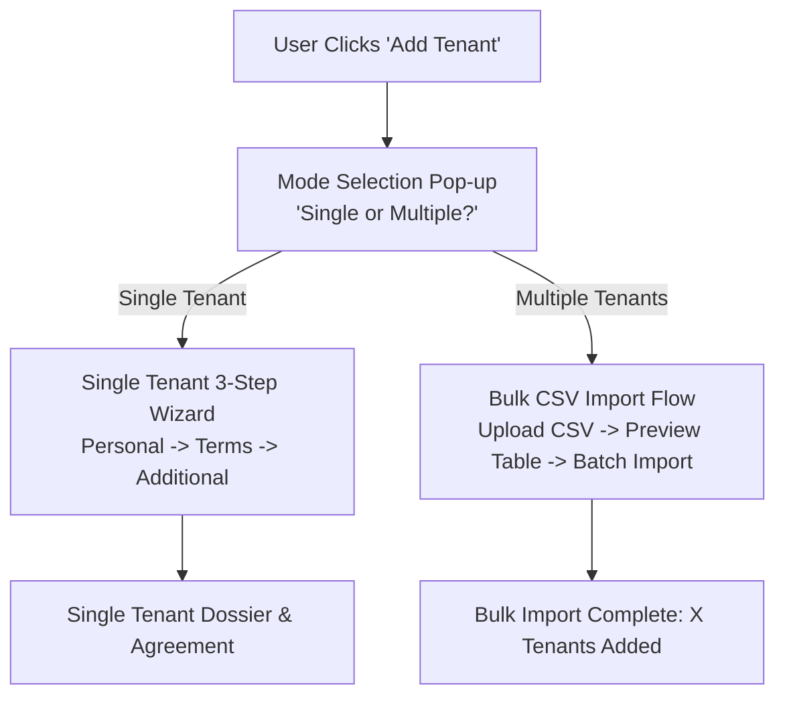

# Proptii — Add Tenant Screen Rework

A high-fidelity, interactive implementation of the **Add Tenant** multi-step workflow for the **Proptii** property management platform. Built strictly following the provided Figma/UI design guide images, utilizing the authentic Proptii design tokens, typography, and layout.

---

## 🎨 Visual Design & Fidelity

The implementation recreates the screens from the guide with high visual fidelity:

## 🔀 New Add Tenant Flow Architecture

Instead of immediately redirecting to a single-tenant form, the flow now surfaces an initial **Add Tenant Mode Selection Pop-up**:



### 1. Choice Pop-up Modal (`Single` vs `Multiple`)
- Surfaces automatically when initiating the Add Tenant flow or clicking "Change Mode".
- **Option 1: Single Tenant**: Guided 3-step personal and tenancy wizard for adding an individual tenant.
- **Option 2: Multiple Tenants**: Bulk spreadsheet onboarding via CSV or XLSX.
- Mode switcher badge embedded directly in the top navigation breadcrumbs so users can toggle modes at any time.

### 2. Single Tenant Workflow
- **Step 1: Who is the tenant? (Personal Details)**: Full name, email, phone with real-time validation and input icons.
- **Step 2: Tenancy terms (Lease and payment details)**: Property selection, rent amount with automatic weekly breakdown, payment frequency, and 1-click lease duration pills (`6M`, `12M`, `24M`, `36M`).
- **Step 3: Additional details (Optional)**: Emergency contact, employment details, notes, with `Save Tenant` and `Skip & Save` actions.
- **Completion Checkmarks**: Circular badges on the left stepper are checked (`✓`) with animations as each step completes.

### 3. Multiple Tenants (Bulk CSV Import) Workflow
- **Download CSV Template**: 1-click button to download `proptii_tenant_import_template.csv` formatted with required headers.
- **Drag & Drop Upload Zone**: Prominent **"Import CSV"** button supporting `.csv` and `.xlsx` files up to 10MB.
- **⚡ Try Demo CSV (5 Tenants)**: 1-click button to immediately load a verified 5-tenant UK dataset for instant review without needing a file.
- **Parsed Data Table**: Live preview showing Tenant Name, Contact, Property Address, Rent, and Lease dates with a verification status pill (`✓ Ready`).
- **Batch Onboarding**: 1-click **"Confirm & Import X Tenants"** button that batches and registers all tenants into local storage history and displays a bulk success summary.

4. **Step 4: Success Confirmation & Tenant Dossier**
   - Animated checkmark badge
   - Detailed tenant overview card with initials avatar, assigned property, financial breakdown, and emergency contact details
   - Quick actions: "Add Another Tenant" and "View in Dashboard"

5. **Responsive Stepper Sidebar**
   - Left-hand navigation card with 3 step states (Default, Active, Completed with checkmark badge)
   - **Inline SVGs for all containers**: User (Step 1), Property / Home (Step 2), Shield (Step 3) - guaranteed to render with zero external CDN dependencies
   - **Completion Checkmarks**: When a step is completed, the circular ring on the right is checked with a crisp blue checkmark (`✓`)
   - Clickable navigation between completed/accessible steps
   - Mobile-responsive layout: collapses into a compact top stepper bar on smaller viewports

---

## 🛠 Tech Stack & Assets

- **HTML5 & Vanilla JavaScript**: Zero build step required, instant loading in any browser.
- **100% Native Inline SVGs**: Zero reliance on external icon CDNs (eliminates blank icon issues completely).
- **Design System Tokens**:
  - Headings: `Archivo` (Google Fonts)
  - Body & UI: `Nunito Sans` (Google Fonts)
  - Primary Blue: `#136C9E`
  - Primary Blue Hover: `#0e557d`
  - CTA Warm Orange: `#DC5F12`
  - Accent Purple: `#8B5CF6`
  - Border Gray: `#e2e8f0`
- **Background Asset**: High-resolution pastel mesh gradient (`assets/bg-mesh.png`) matching the design mockup.
- **Brand Logo**: Proptii SVG/PNG logo (`assets/proptii-logo.png`).

---

## 🚀 Quick Start / How to Run

You can open the project directly in your browser:

### Option 1: Direct File Open
Double-click `index.html` in Windows Explorer or open it in Google Chrome / Edge:
```
file:///C:/Users/ESMIS%202601/.gemini/antigravity/scratch/proptii-add-tenant/index.html
```

### Option 2: Local HTTP Server (Python / Node)
```powershell
cd "C:\Users\ESMIS 2601\.gemini\antigravity\scratch\proptii-add-tenant"
python -m http.server 8080
# Or: npx serve
```
Then visit `http://localhost:8080` in your browser.

---

## 💡 Interactive Features Included

- **⚡ 1-Click "Fill Demo Data"**: Click the sparkles button in the top navigation bar to instantly populate all 3 steps with realistic UK tenant data (e.g. *James Okafor*).
- **💾 Auto-Save Drafts**: Current form inputs are preserved in `localStorage`, so accidental page refreshes do not lose data.
- **📅 Smart Date Calculators**: Changing the lease duration pill automatically computes the lease end date relative to the start date.
- **💷 Dynamic Rent Calculations**: Typing a monthly rent shows the live weekly equivalent (e.g., `£1,200/mo` = `£276.92/week`).
- **⚠️ Discard Confirmation Modal**: Clicking the close button (`✕`) prompts the user to confirm whether to discard unsaved edits.
